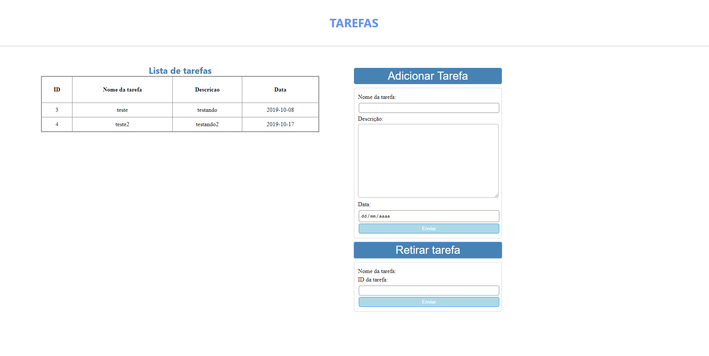

# ToDo-list-em-PHP
Aplicação para controlar tarefas a se fazer.

Funcionamento:

A interface é dividade em 3 partes.

A primeira parte é a listagem das tarefas, caso tenha alguma.
Seria feito uma busca no banco de dados em todos os campos da tabela 'tarefa' e então mostrado no documento HTML.

A segunda parte é o ato de adicionar uma tarefa.
Quando clicado, o botão 'Adicionar tarefa', irá abrir um formulario em tela com oos campos: nome da tarefa , sua descrição e a data.
Apos clicar no botão 'enviar' do formulario , uma nova tarefa seria criada no banco de dados.

A terceira parte é a remoção de uma tarefa da lista.
Quando clicado, o botão 'Retirar tarefa', irá abrir um formulario em tela com oos campos: nome da tarefa , id.
E então seria deletado do banco de dados a tarefa com o id descrito.

